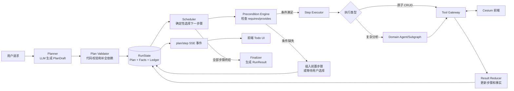

结论：有必要做 V2 的“编排内核重构”，但不需要推倒 FastAPI、LangGraph、DeepAgents、SSE 和现有工具体系。

V1 的核心问题不是框架选错，而是：

> 把任务计划、前置条件、执行进度、重复调用判断和终止条件，过多交给 LLM 从消息历史中自行推断。

DeepAgents 的 `task` 很适合委派，但不应该同时承担生产级 Workflow Engine 的职责。V2 推荐采用：

> LLM 负责理解和规划；确定性状态机负责调度、校验、去重、进度和终止。

# v2的架构思路

## 一、当前架构为什么会出现这些问题

当前 `SpaceAgentState` 只有 `current_scene_name` 和查询结果，没有计划、步骤、依赖、执行记录等状态：[state.py](/Users/caojianming/projects/gis/space-aiagent-v1/.worktrees/codex/space-aiagent-v2/src/space_aiagent/agents/state.py:36)。

场景前置检查虽然写过，但目前被 `1 == 0` 明确关闭：[subagent_tool_validation.py](/Users/caojianming/projects/gis/space-aiagent-v1/.worktrees/codex/space-aiagent-v2/src/space_aiagent/middleware/subagent_tool_validation.py:175)。

SSE 目前只有 token、工具生命周期、interrupt、done/error，没有计划和步骤事件：[sse_schemas.py](/Users/caojianming/projects/gis/space-aiagent-v1/.worktrees/codex/space-aiagent-v2/src/space_aiagent/models/sse_schemas.py:24)。

最终 `AgentResponse` 只有一个状态、一个 code 和 `list[dict]`，难以表达复合任务：[agent_struct_response.py](/Users/caojianming/projects/gis/space-aiagent-v1/.worktrees/codex/space-aiagent-v2/src/space_aiagent/models/response_schema/agent_struct_response.py:75)。

所以 V1 实际是“消息驱动的 Agent 循环”，还不是“有显式执行状态的 Workflow”。

## 二、推荐的 V2 总体架构



关键点是：外层不再由主 Agent 自由决定“继续 task 还是 AgentResponse”，而是 Scheduler 根据状态决定。

DeepAgents 可以继续存在，但降级为“步骤执行器”，不再是整个流程状态的唯一拥有者。

## 三、场景前置条件怎么做

首先需要改变一个认知：

> “场景是否已经打开”不应该由 scene-agent 判断，而应该是系统状态事实。

scene-agent 可以负责查询、打开、创建场景，但前置条件判断应该由确定性代码完成。

### 1. 使用通用 requires/provides

为了遵守“Agent 内核零业务知识”，不要在 Scheduler 中硬编码：

```python
if agent == "entity-agent" and not current_scene_name:
    ...
```

应该把领域规则放在 Action Catalog、工具元数据或配置中：

```yaml
actions:
  open_scene:
    executor: scene-agent
    provides:
      - scene.open

  add_entity:
    executor: entity-agent
    requires:
      - scene.open

  visibility_analysis:
    executor: visibility-agent
    requires:
      - scene.open
      - entity.exists
```

通用编排器只理解：

- `requires`
- `provides`
- `depends_on`
- 当前 `facts`

它不需要知道什么是航天场景。

### 2. 丰富场景状态

不要只保存字符串 `current_scene_name`，建议改成：

```python
class SceneContext(BaseModel):
    status: Literal["unknown", "none", "open"]
    scene_id: str | None
    scene_name: str | None
    revision: str | None
    verified_at: datetime | None
    source: Literal["frontend", "tool_result", "checkpoint"]
```

这里 `unknown` 很重要：

- `none`：确定没有打开场景；
- `open`：确定已经打开；
- `unknown`：后端状态可能已经过期，需要向前端查询。

### 3. 确定性补全依赖

如果用户说“添加文昌地面站”：

- `scene.open` 已存在：直接执行；
- 状态为 `unknown`：先调用前端查询当前场景；
- 状态为 `none`：步骤进入 `waiting_user`，询问打开或创建哪个场景；
- 用户请求中本来包含“先打开场景”：给添加实体步骤增加对打开场景步骤的依赖。

不要让 LLM每次临场决定是否需要场景。

## 四、Todo List 和依赖状态

建议引入一等公民 `WorkflowRun` 和 `PlanStep`。

```python
class WorkflowRun(BaseModel):
    run_id: str
    thread_id: str
    original_request: str
    status: RunStatus
    plan_version: int
    steps: list[PlanStep]
    scene_context: SceneContext
    facts: dict[str, Fact]
    execution_ledger: dict[str, ToolExecution]
    final_result: RunResult | None
```

```python
class PlanStep(BaseModel):
    step_id: str
    parent_step_id: str | None
    title: str
    action: str
    executor: str
    depends_on: list[str]
    requires: list[str]
    provides: list[str]
    inputs: dict
    status: StepStatus
    result: StepResult | None
    error: StepError | None
```

步骤状态建议固定为：

```text
pending
→ ready
→ running
→ waiting_tool / waiting_user
→ succeeded / failed / skipped / blocked / cancelled
```

运行状态建议为：

```text
planning
running
waiting_user
succeeded
partially_succeeded
failed
cancelled
```

终态规则必须由代码保证：

```python
def can_finalize(run: WorkflowRun) -> bool:
    return all(
        step.status in TERMINAL_STEP_STATUSES
        for step in run.steps
    )
```

只要还有 `pending/ready/running/waiting_tool`，就禁止输出最终结果。

### 示例任务

“打开火箭场景，再添加文昌和乌鲁木齐地面站，然后分析文昌地面站可见性”可以生成：

```text
1. 定位并打开火箭场景
   ├─ 查询匹配场景
   └─ 打开选定场景

2. 添加文昌地面站
   depends_on: [1]

3. 添加乌鲁木齐地面站
   depends_on: [1]

4. 对文昌地面站进行可见性分析
   depends_on: [2]
```

这里应区分两种层级：

- `PlanStep`：用户能理解的 Todo，例如“打开火箭场景”；
- `ToolExecution`：内部操作，例如 `query_scenario`、`open_scenario`。

前端默认展示 Todo，展开后再显示工具调用详情，避免把所有内部工具都堆成用户任务。

## 五、如何阻止相同工具和参数无限调用

只依靠 recursion limit 或 prompt 不够，需要 `ExecutionLedger`。

### 1. 计算调用签名

```text
signature =
    step_id
    + tool_name
    + canonical_json(args)
    + scene_revision
```

记录：

```python
class ToolExecution(BaseModel):
    execution_id: str
    step_id: str
    signature: str
    idempotency_key: str
    status: Literal["pending", "succeeded", "failed", "unknown"]
    attempt_count: int
    result: ToolResultEnvelope | None
```

调度规则：

| 已有状态 | 再次出现相同调用 |
|---|---|
| `succeeded` | 不再执行，直接返回缓存结果并结束步骤 |
| `pending` | 复用同一个 Future，不创建第二次调用 |
| 业务失败 | 参数没变化就不重试 |
| 网络超时 | 允许有限重试，但必须复用同一个幂等键 |
| 参数改变 | 作为新调用处理 |

### 2. 增加无进展保护

每个步骤设置：

- 最大模型轮数；
- 最大工具调用数；
- 相同签名成功后再次调用次数为 0；
- 最大连续无状态变化次数；
- 最大可恢复错误重试次数。

例如：

```text
同一步连续两轮：
- 没有新增 fact
- 没有步骤状态变化
- 没有产生新结果

=> 标记 NO_PROGRESS，终止该执行器
```

### 3. 当前重试机制需要特别注意

当前 `RetryMiddleware` 会在工具超时时重新调用 handler：[retry.py](/Users/caojianming/projects/gis/space-aiagent-v1/.worktrees/codex/space-aiagent-v2/src/space_aiagent/middleware/retry.py:117)。

而 `StreamBridge.send_tool_call()` 每次调用都会生成新的 `tool_call_id`：[stream_bridge.py](/Users/caojianming/projects/gis/space-aiagent-v1/.worktrees/codex/space-aiagent-v2/src/space_aiagent/bridge/stream_bridge.py:81)。

这会产生一个生产风险：

```text
前端实际已完成添加实体
→ 回告在网络中丢失
→ 后端超时重试
→ 前端再次添加同一个实体
```

因此 V2 必须增加独立于 `tool_call_id` 的 `idempotency_key`，并要求前端执行端缓存已执行结果。重试时：

- `attempt_id/tool_call_id` 可以变化；
- `idempotency_key` 必须保持不变。

## 六、前端如何获取 Todo List

不能让前端从 `tool_start/tool_end` 猜测 Todo。工具事件是技术层事件，Todo 是业务步骤事件，两者应分离。

建议新增：

```text
plan_snapshot
step_updated
run_updated
```

示例：

```text
event: plan_snapshot
data: {
  "thread_id": "...",
  "run_id": "...",
  "plan_version": 1,
  "seq": 1,
  "steps": [...]
}
```

```text
event: step_updated
data: {
  "run_id": "...",
  "plan_version": 1,
  "seq": 5,
  "step_id": "add_wenchang",
  "status": "succeeded",
  "summary": "文昌地面站已添加"
}
```

现有 `tool_*` 事件也要补充：

```text
run_id
step_id
execution_id
attempt_id
idempotency_key
```

前端展示流程：

1. SSE 建立后首先收到完整 `plan_snapshot`；
2. 后续根据 `step_updated` 增量更新；
3. 根据 `seq` 去重和处理乱序；
4. 页面刷新后通过 `GET /runs/{run_id}` 获取完整快照；
5. SSE 只负责实时通知，不能作为唯一状态存储。

建议把 `thread_id` 和 `run_id` 分开：

- `thread_id`：一段对话；
- `run_id`：用户的一次任务请求；
- `step_id`：一次 Todo；
- `execution_id`：某一步内部的一次工具执行。

## 七、是否需要结构化输出

需要，但不是让所有结果都塞进同一个 `list[dict]`。

推荐分三层。

### 1. 控制平面：必须严格结构化

包括：

- Plan
- PlanStep
- SceneContext
- Preconditions
- StepStatus
- ToolExecution
- RunStatus

这些字段决定程序如何运行，不能使用自然语言猜测。

### 2. 工具结果：统一信封，Payload 按类型扩展

```python
class ToolResultEnvelope(BaseModel):
    success: bool
    code: str
    message: str
    result_type: str
    payload: JsonValue
    state_updates: dict
    artifacts: list[ArtifactRef]
```

内置能力可以使用 Pydantic 判别联合：

```python
payload: (
    SceneQueryPayload
    | EntityMutationPayload
    | VisibilityAnalysisPayload
)
```

例如：

```text
SceneQueryPayload:
  items: list[SceneInfo]

EntityMutationPayload:
  entity_ids: list[str]
  entity_names: list[str]

VisibilityAnalysisPayload:
  intervals: list[TimeInterval]
  metrics: dict
  artifact_ref: str | null
```

未来客户 Skill 可以使用：

```text
result_type + schema_id + payload
```

通过 Schema Registry 校验，不必每增加一种分析结果就修改统一模型。

### 3. 最终响应：聚合步骤结果

```python
class RunResult(BaseModel):
    run_id: str
    status: Literal[
        "succeeded",
        "partially_succeeded",
        "failed",
        "waiting_user",
    ]
    summary: str
    steps: list[StepResult]
    primary_result: ResultRef | None
```

最终自然语言可以保留，但它只是展示层。真实数据必须来自工具结果和步骤结果，不应让 LLM重新复制、拼接或推测。

当前 `AgentResponse` 可以作为 V1 兼容投影继续存在，但不再承担 V2 的内部流程控制。

## 八、要不要更换 LangGraph 或引入 Temporal

当前阶段不建议更换。

LangGraph 已经具备：

- 显式 StateGraph；
- 条件边；
- `Command(goto/update)`；
- Checkpointer；
- interrupt/resume；
- 子图。

足够实现上述 V2。推荐：

```text
自定义 LangGraph StateGraph 作为外层 Workflow Runtime
    └── DeepAgents/domain agent 作为某类 Step Executor
```

只有出现以下需求时才考虑 Temporal/Camunda：

- Workflow 持续数小时或数天；
- 跨多个服务和进程；
- 需要可靠定时器；
- 需要补偿事务；
- Worker 崩溃迁移和高可用要求很强；
- 大规模后台批处理，不依赖当前 SSE 会话。

目前直接引入 Temporal 会显著增加运维和认知成本。

## 九、建议的 V2 改造顺序

这属于架构任务，按仓库约定应先写设计文档并更新白皮书看板。当前看板下一项是 Phase 2C，如果启动 V2 确定性编排，应记录为有原因的插队。

推荐顺序：

1. 定义 `WorkflowRun/PlanStep/StepResult/ToolResultEnvelope` 协议。
2. 编写自定义外层 `StateGraph`，现有 subagent 暂时原样复用。
3. 增加 Scheduler、终态门禁、requires/provides 前置条件引擎。
4. 增加 ExecutionLedger、幂等键和无进展检测。
5. 扩展 SSE：`plan_snapshot/step_updated/run_updated`。
6. 增加前端 Run Snapshot 查询接口。
7. 最后迁移 `AgentResponse`，保留一段时间兼容适配。
8. 建立复合任务行为测试，而不只是提示词文本测试。

因此最合适的 V2 定位不是“换一套 Agent 框架”，而是：

> 在现有 Agent 能力外增加一个真正拥有计划、状态、依赖和执行账本的确定性 Workflow Runtime。


# Deep Agents 规划与本方案的规划的区别
是的，Deep Agents 确实能进行规划并拆成 TodoList。但它提供的是“Agent 自我管理用的计划”，而我前面建议的是“系统强制执行的 Workflow 状态”。二者外观看起来相似，控制权完全不同。

## 关键区别

Deep Agents 的 TodoList 本质上是：

```text
LLM 觉得任务复杂
→ 调用 write_todos
→ LLM 自己修改 pending/in_progress/completed
→ LLM 自己决定下一步调用哪个 task
→ LLM 自己判断何时结束
```

确定性 Workflow 则是：

```text
LLM 提议执行计划
→ 程序校验计划
→ Scheduler 根据依赖选择下一步
→ 工具结果自动更新步骤状态
→ Scheduler 强制执行剩余步骤
→ 所有步骤终结后才允许结束
```

| 能力 | Deep Agents Todo | 确定性 Workflow |
|---|---|---|
| 生成计划 | LLM | LLM |
| 修改计划 | LLM 调用 `write_todos` | LLM 提议，代码校验 |
| 状态更新 | LLM 自己标记 | 工具结果驱动 |
| 步骤依赖 | 通常写在自然语言里 | `depends_on` 显式字段 |
| 前置条件 | Prompt 提醒 | 代码强制检查 |
| 下一步选择 | LLM | Scheduler |
| 防止提前结束 | Prompt | 状态机门禁 |
| 重复工具调用 | 调用次数限制 | 执行账本、签名、幂等键 |
| 失败/阻塞 | 没有正式状态 | `failed/blocked/waiting_user` |
| 结果绑定 | Todo 与工具结果没有强绑定 | 每个 Step 绑定 Result |
| 适用范围 | Agent 自我规划、用户进度提示 | 有副作用、强依赖的业务流程 |

## Deep Agents 的 Todo 到底是什么

当前官方文档把 Todo 描述为一个“轻量规划层”：任务只有 `pending`、`in_progress`、`completed` 三种状态，并保存在 Agent State 中。[Deep Agents 官方文档](https://docs.langchain.com/oss/python/deepagents/overview)

其底层 `write_todos` 的行为非常简单：

```python
Command(
    update={
        "todos": todos,
        "messages": [...]
    }
)
```

也就是模型每次传入一个新的 Todo 数组，覆盖当前数组。它没有自动处理：

- 步骤 ID；
- 依赖关系；
- 场景前置条件；
- 工具结果与 Todo 的绑定；
- 失败和阻塞；
- 幂等调用；
- 是否允许结束。

`TodoListMiddleware` 主要提供：

- `write_todos` 工具；
- Todo 使用提示词；
- 防止同一轮并行调用多个 `write_todos`。

它不会验证“这个步骤是否真的完成”。

例如模型完全可能：

```text
1. 打开场景：completed
2. 添加文昌地面站：pending
```

然后直接输出最终答案。Todo 仍然存在，但没有运行时阻止它结束。

## 为什么你这次日志仍然会失败

按照 Deep Agents 的执行方式，过程类似：

```text
主模型：
  我知道应该先 scene-agent，再 entity-agent

主模型：
  调用 task(scene-agent)

scene-agent：
  打开成功，添加实体超出我的范围

主模型：
  决定整个任务结束，输出 OUT_OF_SCOPE
```

即使当时生成了 Todo：

```text
[completed] 打开场景
[pending] 添加文昌地面站
```

下一步是否调用 entity-agent，依然取决于主模型是否认真检查 Todo。Todo 本身不会触发 task。

另外，你当前环境安装的是 Deep Agents `0.6.10`，项目依赖写的是 `deepagents>=0.6.8`：[pyproject.toml](/Users/caojianming/projects/gis/space-aiagent-v1/.worktrees/codex/space-aiagent-v2/pyproject.toml:19)。

0.6.10 默认带 Todo，但其提示词明确建议“少于三个步骤的简单任务可以不创建 Todo”。你这个“打开场景 + 添加实体”只有两个高层步骤，所以模型很可能根本不调用 `write_todos`。

更值得注意的是，Deep Agents 0.7 已经把 Todo 改成可选能力，官方解释是默认 Todo 增加了成本和延迟，但在评测中没有改善任务表现；升级后需要显式配置 `TodoListMiddleware()`。[Deep Agents 0.7 更新日志](https://docs.langchain.com/oss/python/releases/changelog#jul-24-2026)

这也从侧面说明：官方定位 Todo 是辅助规划能力，不是可靠的 Workflow Engine。

## `task` 与 Todo 也没有自动关联

Deep Agents 的 `task` 用于启动隔离的临时子 Agent。官方定义的关键特性是：

- 每次调用都是临时、独立执行；
- 子 Agent 只看到传给它的任务描述；
- 最终只向主 Agent返回一次报告；
- 子 Agent 本身是无状态的。

它并不知道自己对应哪个 Todo，也不会自动把 Todo 标记完成。[Deep Agents 子 Agent 文档](https://docs.langchain.com/oss/python/deepagents/overview#subagents)

所以目前是两套并列能力：

```text
write_todos：模型的任务清单
task：模型的子 Agent 调用工具
```

并不是：

```text
Todo Step
→ 自动绑定 Agent
→ 自动执行
→ 自动更新状态
```

## 两者可以结合，不需要二选一

推荐分成两层。

### 外层：业务 Workflow

这是前端真正展示、后端真正执行的计划：

```text
Step 1 打开场景
  provides: scene.open

Step 2 添加文昌地面站
  requires: scene.open
  depends_on: Step 1
```

状态由 Scheduler 和工具结果更新，LLM不能随意把它改成完成。

### 内层：Deep Agent Todo

某个复杂分析步骤内部，可以继续让 Deep Agent 自己管理 Todo：

```text
Workflow Step：执行文昌地面站可见性分析

内部 Deep Agent Todo：
- 查询地面站位置
- 查询卫星轨道
- 计算可见时间窗口
- 整理分析结果
```

外层只关心这个分析步骤最终是：

```text
succeeded / failed / waiting_user
```

内层 Todo 是 Agent 的工作草稿，不直接作为整个产品的业务状态。

## 是否一定要自建外层 Workflow

可以按风险决定。

如果是以下场景，Deep Agents Todo 基本够用：

- 搜索资料；
- 写报告；
- 代码分析；
- 偶尔漏一步可以人工重试；
- 工具大多是只读操作。

但你的系统存在：

- 打开场景前置条件；
- 创建实体等有副作用操作；
- 工具超时可能导致重复创建；
- 多 Agent 依赖；
- 前端需要可靠展示进度；
- HITL 和断点恢复；
- 不能提前结束。

这已经超出了轻量 Todo 的适用范围。

Deep Agents 官方也明确建议：当默认 Agent Loop 不适合、需要自定义执行图时，应下降到 LangGraph 构建自定义 Graph；同时 Deep Agent 仍然可以作为图中的子 Agent 使用。[Deep Agents 与 LangGraph 的定位](https://github.com/langchain-ai/deepagents#how-is-this-different-from-langgraph-or-langchain)

因此最准确的关系是：

> Deep Agents 可以当 Planner 和步骤执行器；LangGraph 自定义 StateGraph 负责业务 Workflow 的确定性调度。

前端当然也可以直接读取 Deep Agents 的 `stream.values.todos` 来展示 Todo，官方提供了这种 UI 方案。[TodoList 前端文档](https://docs.langchain.com/oss/python/deepagents/frontend/todo-list)  
但在你的项目中，它更适合作为开发调试或内部执行过程展示，不应该成为“业务任务是否真的完成”的唯一事实来源。