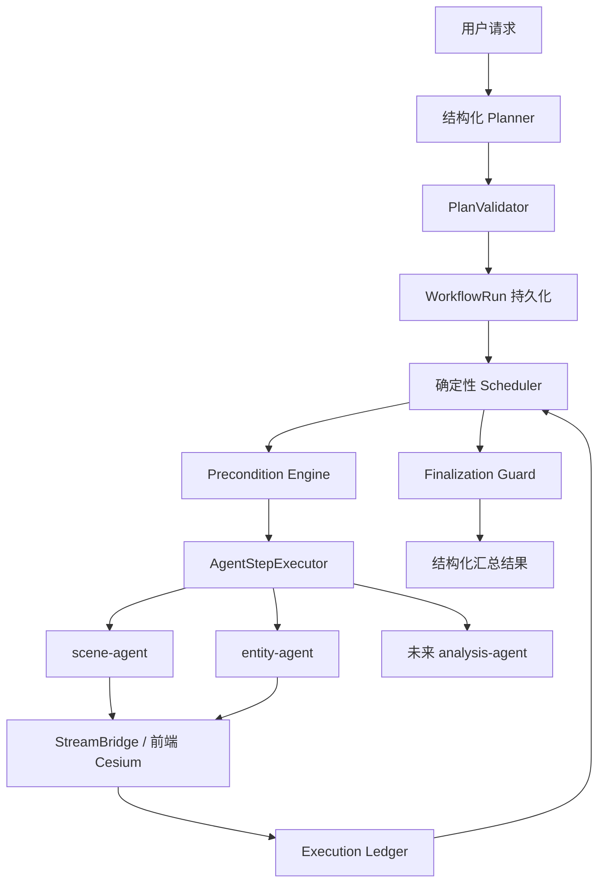

# Space AI Agent V2：确定性工作流 + DeepAgents Worker 架构方案

## 1. 架构结论

V2 采用“外层确定性、内层智能化”的混合架构：



首版确定如下：

- `/api/v1` 冻结保留，新增并行的 `/api/v2`。
- V2 不再由自由 ReAct 主智能体控制任务顺序。
- Planner 只生成结构化计划，不绑定领域工具。
- LangGraph 负责状态流转；Scheduler、前置条件、结束判断均为代码。
- 首版继续复用现有 `scene-agent`、`entity-agent`，不把领域工具绑定给 Planner。
- `open-scenario`、`add-entity` 等 Skill 继续保留，但只负责单步骤 SOP，不负责跨步骤调度。
- 前端同步升级完整 V2 协议，包括计划进度、关联 ID、场景版本和幂等缓存。
- 首版只预留 Sandbox Executor 接口，不实现生产脚本沙箱。
- 不通过微调模型解决流程确定性问题；微调只作为未来意图识别质量优化手段。
- 首版固定当前兼容的 DeepAgents 0.6.10，升级 0.7 作为独立兼容性任务。

## 2. 核心实现

### 工作流模型和持久化

建立独立 `RunRepository`，首版使用单独的 SQLite `workflow.db`，接口不暴露 SQLite 特性，以便后续切换 PostgreSQL。

核心类型：

- `WorkflowRun`
  - `run_id`、`thread_id`、`original_intent`
  - `status`、`revision`、`scene_context`
  - `steps`、`waiting_context`、`final_result`
  - `created_at`、`updated_at`
- `PlanStep`
  - `step_id`、`action`、`title`、`args`
  - `depends_on`、`requires`、`provides`
  - `required`、`executor`
  - `status`、`result`、`error`、`attempt_count`
- `ToolExecution`
  - `execution_id`、`step_id`、`tool_call_id`
  - `idempotency_key`、`fingerprint`
  - `status`、`attempt`、`request`、`result`
- `StepResult`
  - `status`、`code`、`summary`
  - `data`、`effects`、`evidence`
  - `retryable`、`error`
- `RunResult`
  - 整体状态、步骤结果列表、成功效果、失败和阻塞原因。

运行状态：

```text
planning → running → waiting_user → running
                   ↘ succeeded
                   ↘ partially_succeeded
                   ↘ failed
                   ↘ cancelled
```

步骤状态：

```text
pending → ready → running → waiting_tool → succeeded
                    ├→ waiting_user
                    ├→ failed
                    ├→ blocked
                    ├→ skipped
                    └→ cancelled
```

`RunRepository` 是业务运行状态、前端进度和审计的唯一事实源；LangGraph Checkpointer 只保存图游标、消息和 interrupt/resume 上下文。

### Planner、ActionCatalog 和 Scheduler

Planner 使用严格结构化输出 `PlanDraft`：

- 识别用户目标和参数；
- 拆分动作；
- 声明依赖关系；
- 标注仍缺失的信息；
- 不生成可信状态、步骤 ID、执行器名称或幂等键。

`PlanValidator` 负责：

- 分配 `step_id`；
- 对照 ActionCatalog 校验动作；
- 校验 DAG 是否有环；
- 补充 `requires/provides`；
- 选择执行器；
- 拒绝未知动作和非法参数；
- 生成持久化 `WorkflowRun`。

领域知识写入独立 `ActionCatalog`，不硬编码到通用 Scheduler。例如：

```yaml
add_entity:
  executor: entity-agent
  requires: [scene.opened]
  provides: [entity.created]
  side_effect: true
  completion_evidence: addPointEntity.success
  retry_policy: side_effect_safe
```

Scheduler 每次只调度满足以下条件的步骤：

- 状态为 `pending/ready`；
- 所有 `depends_on` 已成功或跳过；
- 所有前置事实成立；
- 没有同一步骤的活跃 execution；
- 没有尚未处理的用户中断。

默认失败策略为“阻塞依赖步骤，继续无依赖步骤”。任何必需目标失败时，Run 不得报告完全成功。

### 场景前置条件与原始意图续跑

`scene.opened` 由 `SceneContext` 表示：

```text
status: unknown | none | opened
scene_name
revision
verified_at
```

行为固定为：

1. `add_entity` 等步骤要求 `scene.opened`。
2. 当前没有场景时，插入或激活 `ensure_scene_context` 前置步骤。
3. 用户选择已有场景或新建场景后，只完成前置步骤。
4. Scheduler 自动恢复原始待办，不再询问“是否还要添加文昌地面站”。
5. 只有缺少实体坐标、场景候选存在歧义、危险操作确认或用户取消时才再次等待用户。

示例：

```text
原始意图：添加文昌地面站
ensure_scene_context: waiting_user
用户：新建场景
create_scene: succeeded
ensure_scene_context: succeeded
add_entity(文昌地面站): 自动进入 ready 并执行
```

同一 `thread_id` 最多有一个非终态 Run。等待用户时，新输入默认作为当前 Run 的续跑输入；显式 `replace` 会取消旧 Run 并创建新 Run。

### 子 Agent、Skills 和执行保护

首版 `AgentStepExecutor` 将单个步骤和有限上下文交给现有子 Agent：

- scene 动作只交给 `scene-agent`；
- entity 动作只交给 `entity-agent`；
- 子 Agent 只允许调用 ActionCatalog 为当前步骤授权的工具；
- 子 Agent 必须返回统一 `StepResult`；
- 当前 `AgentResponse` 仅作为 V1 兼容投影保留。

Skills 的职责调整为：

- `open-scenario`：查询、候选判断、打开场景、返回证据；
- `add-entity`：参数提取、实体工具调用、返回创建结果；
- 跨 Skill 的依赖、Todo 状态和结束判断全部移出 Skill。

增加执行循环保护：

- 默认每个步骤最多 8 次工具调用；
- 相同工具、规范化参数和场景版本构成调用指纹；
- 已成功的副作用调用永不重新执行，直接读取 Ledger 结果；
- 同一失败指纹连续两次无状态变化，步骤以 `NO_PROGRESS` 失败；
- 成功证据满足 ActionCatalog 完成条件后，强制结束该步骤；
- 网络超时最多重试两次，并始终复用同一个 `idempotency_key`；
- 业务失败不得以相同参数盲目重试。

后续版本再把稳定、机械的 SOP 下沉为 `DeterministicActionExecutor`；它是 Scheduler 调用的普通代码节点，不是把全部工具绑定给主模型。

## 3. V2 前端协议

新增端点：

- `POST /api/v2/space/chat`：创建 Run 或续接 waiting Run，返回 SSE。
- `POST /api/v2/space/tool-result`：提交 Cesium 工具执行结果。
- `GET /api/v2/space/runs/{run_id}`：获取完整计划和进度快照。
- `POST /api/v2/space/runs/{run_id}/resume`：提交用户选择并续跑。
- `POST /api/v2/space/runs/{run_id}/cancel`：取消非终态 Run。

新增 SSE 事件：

- `plan_snapshot`
- `step_update`
- `run_update`

保留现有工具生命周期：

```text
tool_start → tool_args → tool_result → tool_end
```

所有 V2 SSE 事件必须包含：

```text
thread_id
run_id
seq
revision
timestamp
```

工具事件另外包含：

```text
step_id
execution_id
tool_call_id
idempotency_key
```

`tool-result` 必须回传：

```text
thread_id、run_id、step_id、execution_id
tool_call_id、idempotency_key
scene_name、scene_revision
success、code、data、error
```

前端同步实现：

- 按 `run_id + revision` 展示 TodoList；
- 按 `seq` 去重并处理断线重连；
- 页面刷新后通过 GET Run Snapshot 恢复进度；
- 按 `idempotency_key` 缓存已执行的副作用结果；
- 收到重复工具请求时不再次操作 Cesium，直接返回原结果；
- 每次场景切换或结构变化更新 `scene_revision`；
- `interrupt` 后仍以 `done {interrupted:true}` 结束当前 SSE，resume 新开流；
- `/chat` 与 `/resume` 的同线程重入继续返回 `409`。

## 4. 实施顺序与验收

### 阶段一：协议与骨架

- 先更新架构白皮书执行看板、V2 ADR、SSE 对接协议。
- 建立工作流模型、ActionCatalog、RunRepository 和 SQLite Schema。
- 增加 `/api/v2` 路由骨架，V1 行为保持不变。

### 阶段二：确定性工作流

- 实现 Planner、PlanValidator 和 LangGraph 外层状态图。
- 实现 Scheduler、Precondition Engine、Finalization Guard。
- 实现场景缺失的 interrupt/resume 和原始意图自动续跑。

### 阶段三：复用子 Agent

- 将 scene/entity DeepAgents 包装为 `AgentStepExecutor`。
- 约束每一步允许使用的工具。
- 统一转换为 `StepResult`。
- 收窄 Skill 职责并加入无进展终止保护。

### 阶段四：幂等与前端联调

- 实现 Execution Ledger 和稳定幂等键。
- 扩展 StreamBridge 关联字段。
- 完成 V2 SSE、tool-result、Snapshot、resume、cancel 协议。
- 与前端同步完成进度展示、场景版本和幂等缓存。

### 阶段五：测试与灰度

必须覆盖：

- “打开指定场景，再添加文昌地面站”自动连续执行。
- 无场景时选择新建，创建后自动恢复添加实体。
- 查询到多个“火箭”场景时等待用户选择。
- 同时添加文昌、乌鲁木齐地面站，并为未来分析步骤建立依赖。
- 重复调用相同 `open_scenario` 时不重复执行并能终止步骤。
- 前端已执行但回告丢失时，重试不会重复创建实体。
- 必需步骤失败时依赖步骤进入 blocked。
- 无依赖步骤可继续执行并形成部分成功结果。
- SSE 事件顺序、重复事件、断线恢复和 Snapshot 一致。
- 同线程并发 `/chat`、`resume` 继续返回 `409`。
- V1 SSE、HITL、AgentResponse 和现有 Skills 回归测试通过。

部署采用 V1/V2 并行和功能开关；首批只向测试用户开放 V2。指标稳定后再逐步切流，不迁移 V1 历史会话为 V2 Run。

验收标准：

- 跨 Agent 步骤不再依赖主模型“记得继续”。
- 原始意图在 interrupt/resume 后不会丢失。
- 前端能完整展示计划、当前步骤、阻塞原因和最终结果。
- 已成功的副作用工具调用在超时、重连和模型重复调用下均不会重复执行。
- Run 只有在 Finalization Guard 判定所有必需步骤完成后才能返回成功。
