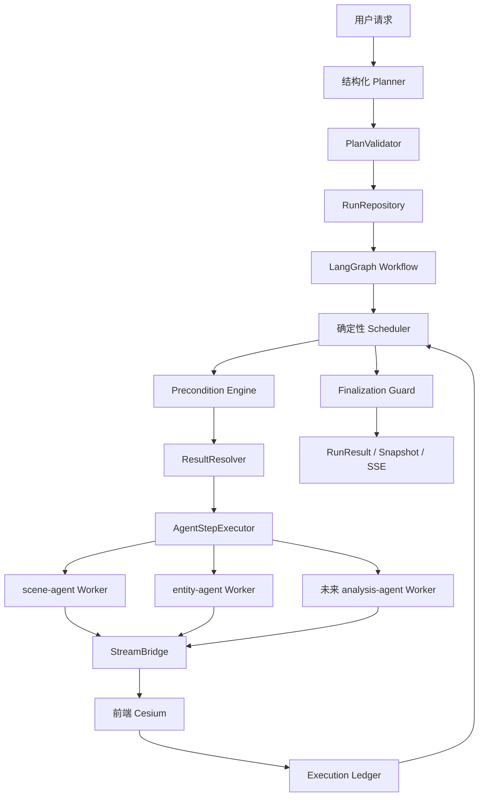
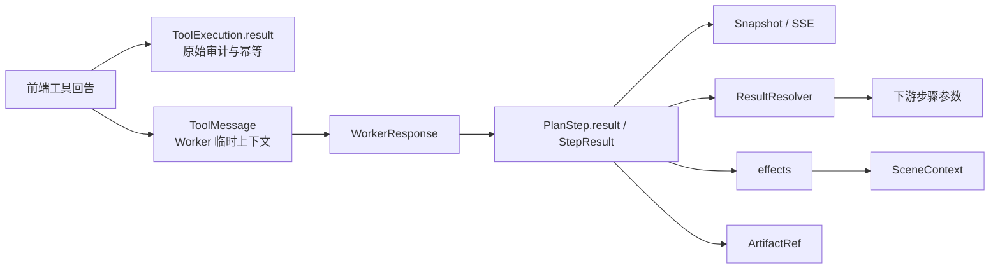

# Space AI Agent V2 架构白皮书

> 状态：V2 唯一架构基线
> 更新日期：2026-08-11

## 1. 架构目标

系统面向 Cesium 航天 GIS 场景，解决复合用户意图的可靠执行问题。核心原则是：

- 外层确定性：计划校验、依赖、前置条件、状态流转、失败传播和结束判断由代码控制。
- 内层智能化：DeepAgents Worker 只处理 Scheduler 授权的一个领域步骤。
- 协议优先：前端、工作流、Worker 和工具之间只通过明确结构化协议交互。
- 结果分层：环境事实、业务结果、工具原始回告和大型产物各自归位。
- 副作用幂等：超时、重连和模型重复调用都不得重复改变 Cesium 状态。

系统不提供自由主 Agent 编排路径，也不维护旧接口兼容层。旧实现只有在承担明确 V2 职责时才复用。

## 2. 总体架构



职责边界：

| 组件 | 负责 | 不负责 |
| --- | --- | --- |
| Planner | 识别目标、拆分动作、声明草案依赖和缺失信息 | 可信步骤 ID、执行器选择、状态判断、工具调用 |
| PlanValidator | ActionCatalog 校验、DAG 校验、补依赖、分配 ID、选择执行器 | 业务执行 |
| Scheduler | ready 判定、失败传播、单步调度、等待与续跑 | 领域参数猜测 |
| Precondition Engine | `scene.opened` 等持续事实检查与前置步骤激活 | 把查询结果塞进 Agent State |
| ResultResolver | 按显式 ResultRef 解析上游输出 | 扫描“最近结果”或按 action 猜来源 |
| Worker | 依据 Skill 执行一个步骤并返回 WorkerResponse | 规划、跨步骤调度、决定 Run 结束 |
| StreamBridge | 发工具事件、等待回告、关联工作流 ID | 直接操作 Cesium |
| RunRepository | Run、Step、Result、Execution、序号的唯一事实源 | 保存大型文件正文 |

## 3. 确定性工作流

### 3.1 运行与步骤状态

Run 状态：

```text
planning → running → waiting_user → running
                   ↘ succeeded
                   ↘ partially_succeeded
                   ↘ failed
                   ↘ cancelled
```

Step 状态：

```text
pending → ready → running → waiting_tool → succeeded
                    ├→ waiting_user
                    ├→ failed
                    ├→ blocked
                    ├→ skipped
                    └→ cancelled
```

`RunRepository` 是运行状态、前端进度和审计的唯一事实源。LangGraph Checkpointer 只保存图游标、Worker 消息和 interrupt/resume 上下文。

### 3.2 Scheduler 不变量

步骤只有在以下条件同时满足时才可执行：

1. 状态为 `pending` 或 `ready`。
2. 直接依赖已成功或按策略跳过。
3. ActionCatalog 声明的前置事实成立。
4. 没有同一步骤的活跃 ToolExecution。
5. Run 没有尚未处理的用户中断。

默认失败策略是阻塞依赖步骤，同时继续无依赖步骤。任一必需步骤失败时，Finalization Guard 不得返回完全成功。

### 3.3 场景前置条件与续跑

`SceneContext` 只表示持续有效的当前环境事实：

```text
status: unknown | none | opened
scene_name
revision
verified_at
```

当 `add_entity` 等动作缺少 `scene.opened` 时，工作流激活 `ensure_scene_context`。用户选择已有场景或新建场景后，Scheduler 自动恢复原始待办，不再次询问是否继续原目标。

同一 `thread_id` 最多有一个非终态 Run。等待期间的新输入默认续接当前 Run；显式 `replace` 才取消旧 Run 并建立新 Run。

## 4. 通用结果与状态边界



固定规则：

- Worker 使用 DeepAgents 默认 `DeepAgentState`，不声明任何航天领域字段。
- Worker 所需的只读场景前置事实由 `StepExecutionContext` 从 `WorkflowRun.scene_context` 投影，
  不写入 LangGraph State。
- `StepResult.data` 保存小型、规范化业务结果，是前端展示和下游绑定的来源。
- `ToolExecution.result` 保存原始回告、重试和幂等证据，不直接作为业务输入。
- `SceneContext` 只保存当前环境事实，不保存候选列表或分析结果。
- 大型报告、图表和数据集使用 `ArtifactRef`；WorkflowRun 不保存二进制或大型正文。
- 下游只可通过显式 `ResultRef(source_step_id, pointer)` 读取上游结果。
- 不新增 `scenario_query_results`、`report_results` 一类业务专用 State 字段。

ResultRef 使用 RFC 6901 JSON Pointer。Validator 拒绝未知、当前或后序步骤引用，自动补直接依赖，并拒绝同一参数同时出现在 `args` 与 `input_bindings`。

## 5. Worker、Skill 与工具安全

### 5.1 Worker

Worker 在 `config/workers.yaml` 声明模型提示词、工具组、Skill 路径和 HITL 规则。`AgentStepExecutor` 每次只传入一个 Action 和有限上下文，并要求返回 `WorkerResponse`。

ActionCatalog 是动作到 Worker、前置事实、完成证据和授权工具的可信映射。Worker 无权扩大工具范围，也不能创建后续步骤。

### 5.2 Skill

Skill 是单步骤 SOP：

- `open-scenario` 负责查询、候选判断、打开与证据返回。
- `add-entity` 负责参数规则、实体工具调用和创建结果。
- Skill 不管理 Todo、跨 Skill 依赖、Run 状态或结束条件。

Skill 使用 Markdown + YAML frontmatter，通过 SkillCatalog 校验，由 Flash 路由器在 Worker 内预路由。未知或无法可靠加载时 fail-closed，不允许绕过受管工具。

### 5.3 执行保护

- 每步骤默认最多 8 次业务工具调用。
- 工具名、规范化参数和场景版本组成 fingerprint。
- 已成功副作用调用直接读取 Ledger，不重新执行。
- 同一失败 fingerprint 连续两次且无状态变化时，以 `NO_PROGRESS` 结束步骤。
- 满足 ActionCatalog 完成证据后强制结束 Worker 步骤。
- 网络超时重试复用同一 `idempotency_key`；业务失败不得盲目重试。

未来机械且稳定的 SOP 可下沉到 `DeterministicActionExecutor`。它是 Scheduler 的普通代码节点，不是把所有工具交给 Planner。

## 6. API 与前端协议

### 6.1 执行进度看板（单一事实源）

> 本节是当前阶段和下一任务的唯一权威来源。

| 顺序 | 阶段 / 任务 | 交付与验收证据 | 状态 |
| --- | --- | --- | --- |
| 1 | 可观测性与失败恢复基础 | OTel/Langfuse NoOp 降级、RetryMiddleware | ✅ 已完成 |
| 2 | SSE + POST 传输与 HITL | StreamBridge、interrupt/resume、同线程 409 | ✅ 已完成 |
| 3 | Skill Package 与门禁 | CompositeBackend、SkillCatalog、3 个内置 Skill、fail-closed | ✅ 已完成 |
| 4 | V2 确定性工作流 | Planner、Validator、Scheduler、Precondition、Ledger、Finalization Guard | ✅ 已完成（2026-08-11） |
| 5 | V2 通用结果通道 | StepResult、ResultRef/InputBinding、ArtifactRef、删除业务专用 State | ✅ 已完成（2026-08-11） |
| 6 | 单一 V2 架构收敛 | 删除旧接口、自由主 Agent、WebSocket 模型和兼容中间件；Worker 语义统一 | ✅ 已完成（2026-08-11） |
| 7 | 多模型动态路由 | Planner、Worker、Flash 路由职责可配置、可观测、可降级 | ▶ **下一任务** |
| 8 | Backend/Policy 与脚本沙箱 | CommandGuard、Sandbox Executor、脚本执行审计 | ⏸ 首个脚本型生产 Skill 出现后 |
| 9 | 分析与报告原子能力 | 数据查询、分析 Worker、Artifact 存储服务 | ⬜ 待开始 |
| 10 | 系统指标与横切能力 | Prometheus、RBAC、完整审计、Skill 生命周期 | ⬜ 待开始 |

维护规则：完成任务时同步状态、日期和测试证据；插队任务写明原因；受条件阻塞的任务不阻止下一个可执行项。

### 6.2 HTTP 端点

- `POST /api/v2/space/chat`
- `POST /api/v2/space/tool-result`
- `GET /api/v2/space/runs/{run_id}`
- `POST /api/v2/space/runs/{run_id}/resume`
- `POST /api/v2/space/runs/{run_id}/cancel`
- `GET /api/v2/space/health`

系统只提供上述 V2 协议。

### 6.3 SSE 事件

- 计划与进度：`plan_snapshot`、`step_update`、`run_update`
- 工具生命周期：`tool_start → tool_args → tool_result → tool_end`
- 人机协同与终态：`interrupt`、`done`、`error`

每个事件包含 `thread_id`、`run_id`、`seq`、`revision`、`timestamp`。工具事件额外包含 `step_id`、`execution_id`、`tool_call_id`、`idempotency_key`。

前端按 `run_id + revision` 展示 Todo，按 `seq` 去重，刷新后通过 Snapshot 恢复，并按 `idempotency_key` 缓存副作用结果。

## 7. 持久化与部署

首版 `RunRepository` 使用独立 SQLite `workflow.db`，接口不暴露 SQLite 特性，后续可切 PostgreSQL。数据库保存 JSON payload，因此通用结果模型扩展无需为每种业务结果改表。

部署是断代 V2：不迁移旧对话或历史 checkpoint，不恢复旧 URL。产品上线前统一删除旧
`space_aiagent.db` 和 `workflow.db`，由 V2 首次启动创建全新数据库；仓库不维护 checkpoint
字段级迁移代码。

## 8. 架构不变量

1. Planner 不绑定领域工具。
2. 跨步骤顺序不依赖模型“记得继续”。
3. 创建实体前必须有可信 `scene.opened`。
4. 所有 Cesium 操作必须经过 StreamBridge 和前端回告。
5. Run 只有在 Finalization Guard 验证全部必需步骤后才能成功。
6. 领域事实和业务结果不得写入 Worker State；默认 `DeepAgentState` 只承载框架消息与控制状态。
7. 已成功副作用调用在重试、重连和重复请求下不得再次执行。
8. 可观测性不可用时，业务通过 NoOp 路径继续运行。

## 附录：术语

| 术语 | 定义 |
| --- | --- |
| Planner | 生成不可信结构化计划草案的模型节点 |
| Scheduler | 以代码控制步骤状态、依赖和调度的组件 |
| Worker | 执行单个授权领域步骤的 DeepAgents 实例 |
| Skill | Worker 命中某类动作后遵循的单步骤 SOP |
| ActionCatalog | 动作契约、执行器、前置条件、完成证据和工具授权的可信目录 |
| WorkflowRun | 一次用户复合意图的持久化运行实例 |
| StepResult | 单步骤规范化业务结果 |
| ToolExecution | 单次工具调用的审计与幂等记录 |
| ArtifactRef | 大型报告、图表或数据集的外部引用 |
