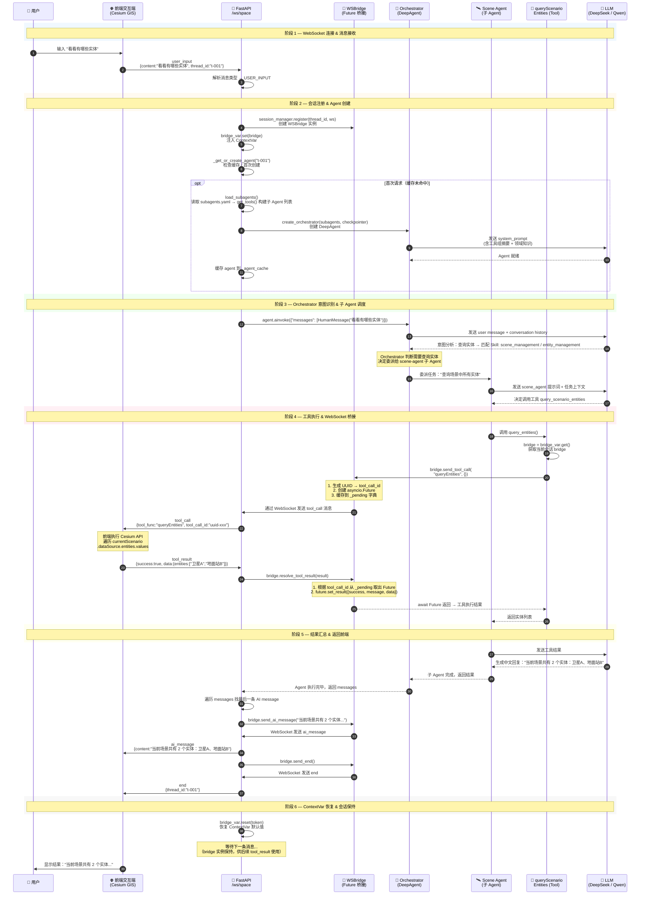

# DEV.md — 开发参考

## 核心链路时序图：用户查询实体列表

以"看看有哪些实体"为例，展示从用户输入到 Agent 返回结果的完整时序。



---

## 关键节点详解

### 1. ContextVar 注入机制 (`bridge_var`)

```python
# bridge/__init__.py
bridge_var: ContextVar[WSBridge | None] = ContextVar("bridge_var", default=None)
```

- WebSocket handler 在处理 `user_input` 时调用 `bridge_var.set(bridge)` 注入当前会话的 bridge
- 工具函数通过 `bridge_var.get()` 获取 bridge，无需传参
- 请求处理完毕后 `bridge_var.reset(token)` 恢复默认值

### 2. Future 桥接机制 (`WSBridge`)

```
send_tool_call()                    resolve_tool_result()
     │                                     │
     ├─ UUID → tool_call_id                ├─ 取出 future
     ├─ 创建 Future → _pending[id]         ├─ future.set_result(...)
     ├─ 发送 tool_call 到 WebSocket        └─ 清理 _pending
     └─ await future (阻塞，等待前端返回)
```

- 每次工具调用产生唯一的 `tool_call_id`
- Future 用于跨异步上下文传递结果
- 超时默认 60 秒，超时后返回 `{success: false, message: "工具调用超时"}`

### 3. Agent 实例缓存

```python
_agent_cache: dict[str, thread_id] = {}  # thread_id → compiled graph
```

- 每个 WebSocket 会话复用同一个 Agent 实例
- 首次请求时创建（扫描 Skill + 构建子 Agent），后续请求直接取缓存
- LangGraph 的 checkpointer 负责 conversation history 持久化

### 4. 子 Agent 声明式配置

`config/subagents.yaml` 驱动：

```yaml
agents:
  - name: scene-agent
    description: 处理场景相关操作...
    skills: [scene_management]
    prompt_file: scene_agent.md
```

新增子 Agent 只需：加 YAML 条目 + `prompts/` 下加提示词 + `skills/` 下加 Skill 目录。

---

## WebSocket 消息协议速查

| 方向 | 消息类型 | 触发时机 |
|------|---------|---------|
| 前端 → 后端 | `user_input` | 用户发送消息 |
| 前端 → 后端 | `tool_result` | 前端执行完 Cesium 操作 |
| 后端 → 前端 | `tool_call` | Agent 调用工具 |
| 后端 → 前端 | `ai_message` | Agent 生成文本回复 |
| 后端 → 前端 | `end` | 当前轮次结束 |
| 后端 → 前端 | `error` | 异常发生 |

---

## 项目目录速查

```
src/space_aiagent/
├── api/websocket.py       # WebSocket 核心消息循环（入口）
├── agents/orchestrator.py # 主控 Agent 创建（DeepAgent）
├── agents/subagents.py    # 子 Agent 加载器（YAML → DeepAgent subagents）
├── bridge/ws_bridge.py    # Future 桥接核心（send_tool_call / resolve）
├── bridge/session.py      # 会话管理（thread_id → WebSocket 映射）
├── bridge/__init__.py     # bridge_var (ContextVar) 导出
├── tools/registry.py      # 静态工具注册表（标准 import + 按组分组）
├── prompts/               # 提示词模板目录
├── knowledge/             # 领域知识（AGENTS.md）
├── models/                # 数据模型（枚举、Schema、消息类型）
└── infrastructure/        # 基础设施（配置、日志、数据库）
```
